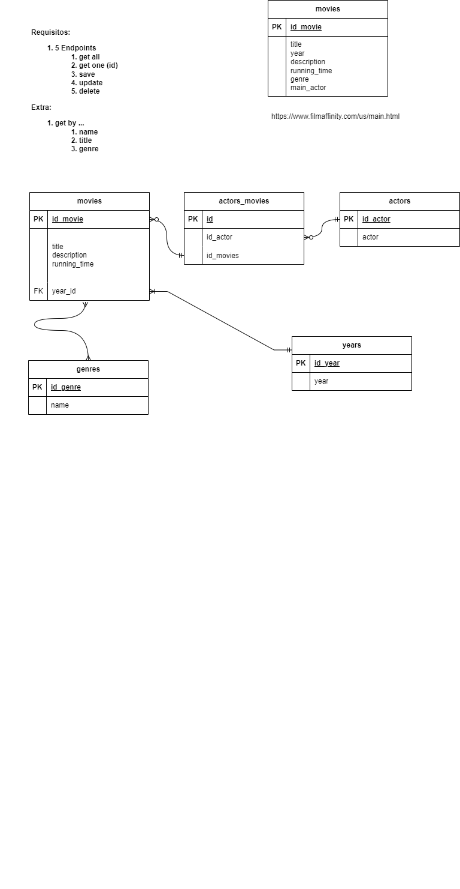

# API Movies Project

This project is an exercise by Factoría F5. The objective of the exercise was to create an API with all the main methods of CRUD (GET, POST, PUT and DELETE). It was also necessary to create One-to-Many and Many-to-Many relations between tables.

An extra objective was to create a sixth endpoint (apart from getAll, getById, post, update, delete) that would get a movie by its' title.

The project was created using Spring and Maven.

## Classes Diagrams

In our case the actors table was not created due to the lack of time

## Run Local Server Command

mvn spring-boot:run

## Spring Dependencies

Spring Data JPA

Spring Boot DevTools

H2 Database

Spring Web

### Thank you!